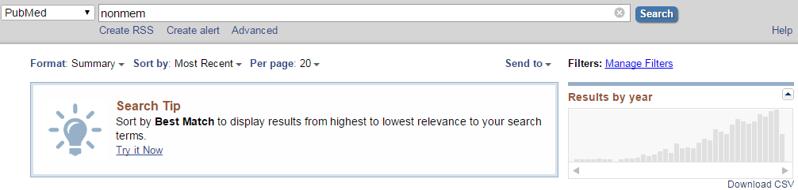

```{r include = FALSE}
knitr::opts_chunk$set(fig.path='{{ site.url }}/images/pubmed-')
```

# Introduction and Methods

The number of publications containing NONMEM was retrieved from the Pubmed search at 2017-04-27 07:30 KST by `Download CSV` functionality and the CSV file was processed by R 3.4.0 [@R-base] and ggplot2 [@R-ggplot2].



# Results

## Plot

Results from a PubMed search for the term, NONMEM were plotted against the year the publication appeared.

```{r setup, message = FALSE, results = 'hide'}
library(knitr)
library(ggplot2)
library(dplyr)
```

```{r fig.cap = "Publications utilizing NONMEM"}
timeline <- read.csv("timeline.csv", skip = 1, stringsAsFactors = FALSE) %>% mutate(percentage = round(count/sum(count)*100, 2)) %>% arrange(year) %>% mutate(cum_percent = cumsum(percentage))
ggplot(data=timeline, aes(x=year, y=count)) +
    geom_bar(stat="identity") + guides(fill=FALSE) +
    xlab("Year") + ylab("Number of Articles") +
    ggtitle("Increase of Articles Using NONMEM")
```

(Information Retrieved from Pubmed Search at 2017-04-27 07:30 KST)

## Raw data

Results from a PubMed search for the term, NONMEM were listed. 

```{r}
knitr::kable(timeline, caption = "Raw data of the number of publications utilizing NONMEM.")
```

# Conclusion

The number of publications utilizing NONMEM tends to increase.

# References

```{r include = FALSE}
knitr::write_bib(file = "packages.bib")
```

